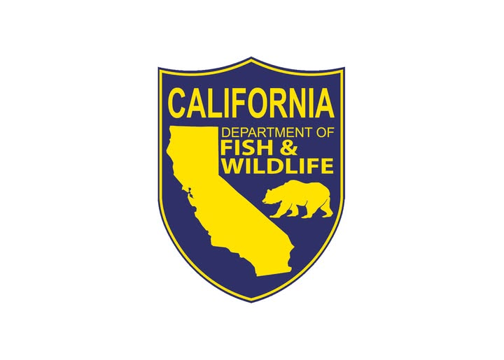
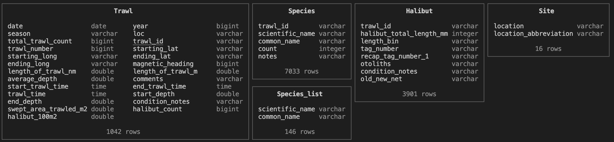

# Juvenile Halibut Research Trawls Database



## Purpose

This project builds a SQL database using research trawl data collected by the California Department of Fish and Wildlife (CDFW) from 2018 to 2025. Data is collected at 9 sites across Southern California, targeting juvenile California halibut in shallow, sandy marine habitats. This database includes geographic information of each trawl, as well as lengths and counts of halibut and other species caught.

## Data

This data is currently not public. Data requests can be sent to CDFW for access to this data by emailing [Miranda.Haggerty\@Wildlife.ca.gov](mailto:Miranda.Haggerty@Wildlife.ca.gov) or submit a data request [here](https://wildlife.ca.gov/General-Counsel/Public-Records-Requests).

## Repository structure

```
├── creating-viz.qmd
├── data-cleaning.qmd
├── database
│   ├── halibut.db
│   ├── ingest_data.sql
│   └──query.sql
├── eds213-juvenile-halibut-trawls.Rproj
├── figs
├── images
├── README.md
└── requirements.txt
```

## Workflow

### Dependencies

All package versions and dependencies to reproduce this project can be found in `requirements.txt`.

### Data cleaning

Data was imported into *RStudio* for cleaning in `data-cleaning.qmd`. All data decisions and cleaning steps were approved by CDFW staff. Other species scientific names and associated common names were standardized. Reporting of invertebrate presence was assigned to notes column. All trawls completed for maturity were removed. After processing the data, clean CSVs are exported and saved to the `processed` folder in the data folder.

### Database

A SQL database was created using *DuckDB* in VSCode. All steps files of data ingestion and querying with DuckDB can be found in the `database` folder. Each clean CSV was ingested as a table in the `halibut.db` database within `ingest_data.sql`. The following tables were created:



A query looking at average halibut size across sites and seasons was ran in `query.sql`.

## Acknowledgements

This project was completed as part of [EDS 213: Databases and Data Management](https://ucsb-library-research-data-services.github.io/bren-eds213/)

A special thanks to Miranda Haggerty and the Southern California Fisheries Research and Management Program for the data access and guidance!
